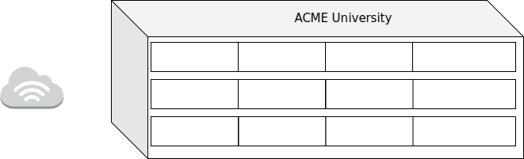
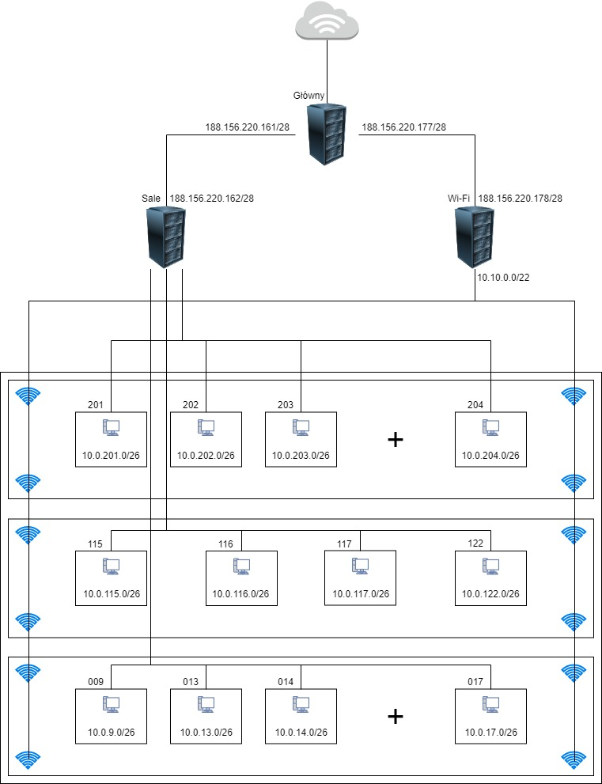

# Zadanie 2

## Projekt sieci lokalnej dla jednostki dydaktycznej uniwersytetu



### Cel Projektu
  Zaprojektowanie i weryfikacja działania sieci w środowisku testowym. 
  Rozwiązanie zapewnia dostęp do internetu dla wszystkich urządzeńw infrastrukturze.
  
### Założenia projektu

* Sieć zlokalizowana jest w budynku 3 kondygnacyjnym
* Na kążdej z kondygnacji znajdują się laboratoria komputerowe kolejno:
  * poziom 0 
    * 009, 013, 014
  * poziom 1
    * 115, 116, 117, 122
  * poziom 2
    * 201, 202, 203
* Każde z laboratoriów wyposażone jest w 35 stanowisk dla uczestników kursów
* Jednostka planuje otworzenie kolejnych laboratoriów 017 oraz 204
* Każda kondygnacja wyposażona jest w izolowaną sieć Wi-Fi, udostępniajacą sieć internet podłączonym gościom
  * Sieć Wi-Fi nie pozwala na bezposrednią komunikację z urządzeniami zlokalizowanymi w pozostałej części sieci,
    tj: laboratoria, serwery jednostki
  * Prognozowana maksymalna liczba jednoczesnych urządzeń podłączonych do sieci to ``800``
* Jednostka posiada przyłącze internetowe oraz dysponuje pulą adresów ``188.156.220.160/27``
* Jednostka posiada serwery udostępniajace zasoby do celów dydaktycznych i promocyjnych
  * serwery zlokalizowane są w osobnym pomieszczeniu
  * udostępniają zasoby w sieci publicznej z wykorzystaniem sieci ``188.156.220.160/27``
  * Jeden serwer pełni rolę bramy dla urządzań w sieci lokalnej ``LAN``

### Wstępne założenia

* Każde laboratorium posiada oddzielną podsieć pozwalającą efektywnie zidentyfikować urządzania
  * kondygnacja oraz sala
* Dla uniknięcia zbyt słabego zasięgu sieć WiFi zostanie wyposażona w 4 urządzenia nadawcze na każdej kondygnacji
 

#### zadanie - wymaganai

* Dokonaj podziału i projektu sieci w formie dokumentu w formacie ``MARKDOW`` zawierającego specyfikację tekstową oraz obrazkową
  projektowanej sieci
* Przygotuj prototyp rozwiązania z wykorzystaniem oprogramowania ``VirtualBox`` lub podobnego.
* W specyfikacji uwzględnij wielkości sieci oraz ich adresy
* W specyfikacji uwzględnij konfigurację tablicy routingu
* Dokumentację graficzną stworzonej architektury przygotuj w programie ``DIA`` lub podobnym


--------------
## Rozwiązanie

* sale - ``188.156.220.160/28``
  * podsieć - ``10.0.0.0/16``
* WI-FI - ``188.156.220.176/28``
  * podsieć - ``10.10.0.0/22``

### Poziom 0
  009, 013, 014, +017 // = 105 + 35 komputerów
  * 009
    *  ``10.0.9.0/26``
  * 013
    *  ``10.0.13.0/26``
  * 014
    *  ``10.0.14.0/26``
  * 017
    *  ``10.0.17.0/26``
    
### Poziom 1
  115, 116, 117, 122 // = 140 komputerów
  * 115
    * ``10.0.115.0/26``
  * 116
    * ``10.0.116.0/26``
  * 117
    * ``10.0.117.0/26``
  * 122
    * ``10.0.122.0/26``
    
### Poziom 2
  201, 202, 203, +204 // = 105 + 35 komputerów
  * 201
    * ``10.0.201.0/26``
  * 202
    * ``10.0.202.0/26``
  * 203
    * ``10.0.203.0/26``
  * 204
    * ``10.0.204.0/26``
  
W sumie 420 komputerów  



## Konfiguracja
``/etc/hostname`` - zmiana nazwy komputera

### Ustawienie statycznego ip
 ``/etc/netplan/01-network-manager-all.yaml``
 
#### Serwer główny
 ```
    network:  
    version: 2  
    renderer: NetworkManager  
    ethernets:  
       enp0s8:  
        dhcp4: no  
        addresses: [188.156.220.161/28]  
        gateway4: 188.156.220.161  
        nameservers:  
          addresses: [8.8.4.4,8.8.8.8]  
       enp0s9:  
        dhcp4: no  
        addresses: [188.156.220.177/28]  
        gateway4: 188.156.220.177  
        nameservers:  
          addresses: [8.8.4.4,8.8.8.8]
  ```
#### Sale
```
    network:  
    version: 2  
    renderer: NetworkManager  
    ethernets:  
       enp0s3:  
        dhcp4: no  
        addresses: [188.156.220.162/28]  
        gateway4: 188.156.220.161  
        nameservers:  
          addresses: [8.8.4.4,8.8.8.8]  
       enp0s8:  
        dhcp4: no  
        addresses: [10.0.201.1/26]  
        gateway4: 188.156.220.161  
        nameservers:  
          addresses: [8.8.4.4,8.8.8.8]  
       enp0s9:  
        dhcp4: no  
        addresses: [10.0.115.1/26]  
        gateway4: 188.156.220.161 
        nameservers:  
          addresses: [8.8.4.4,8.8.8.8]
  ```
#### Wi-Fi
```
    network:  
    version: 2  
    renderer: NetworkManager  
    ethernets:  
       enp0s3:  
        dhcp4: no  
        addresses: [188.156.220.178/28]  
        gateway4: 188.156.220.177  
        nameservers:  
          addresses: [8.8.4.4,8.8.8.8]  
       enp0s8:  
        dhcp4: no  
        addresses: [10.10.0.1/22]  
        gateway4: 188.156.220.177  
        nameservers:  
          addresses: [8.8.4.4,8.8.8.8]  
  ```
### Ip forwarding
``/etc/sysctl.d/99-sysctl.conf``

#### Serwer główny, Sale, Wi-Fi
``net.ipv4.ip_forward=1``

### Masquerade
#### Serwer główny
``sudo iptables -t nat -A POSTROUTING -s 188.156.220.160/28 -o enp0s3 -j MASQUERADE``  
``sudo iptables -t nat -A POSTROUTING -s 188.156.220.176/28 -o enp0s3 -j MASQUERADE``  
``sudo iptables-save | sudo tee /etc/iptables.sav``  

### DHCP
``apt install isc-dhcp-server``  
odkomentować ``config DHCPDv4_CONF``  
#### Sale
``/etc/default/isc-dhcp-server``  
``INTERFACESv4=enp0s8 enp0s9``  
  
``/etc/dhcp/dhcpd.con``  
```
subnet 10.0.201.0 netmask 255.255.252.192 {
        option routers                  10.0.201.1;
        option subnet-mask              255.255.252.192;
        option domain-name-servers      10.0.201.1;
        range                           10.0.201.2 10.0.201.62;
}
subnet 10.0.115.0 netmask 255.255.252.192 {
        option routers                  10.0.115.1;
        option subnet-mask              255.255.252.192;
        option domain-name-servers      10.0.115.1;
        range                           10.0.115.2 10.0.115.62;
}
```
#### Wi-Fi
``/etc/default/isc-dhcp-server``  
``INTERFACESv4=enp0s8``  
  
``/etc/dhcp/dhcpd.con``  
```
subnet 10.10.0.0 netmask 255.255.252.0 {
        option routers                  11.0.0.1;
        option subnet-mask              255.255.252.0;
        option domain-name-servers      11.0.0.1;
        range                           11.0.0.15 11.0.3.250;
}
```
### Routing
``ip route add default via 10.0.115.1``  
``ip route add default via 10.0.201.1``
