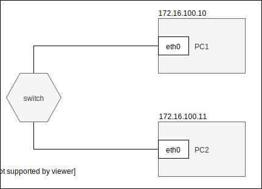

Zadanie
------------

1.1 Przygotuj konfigurację sieci zgodnie z powyższym diagramem,  
1.2 Przetestuj połączenie poleceniem ping  
2.1 Zainstaluj na komputerze ``PC1`` serwer programu ``HTTP CHAT`` dostępnego pod adresem ``https://github.com/jkanclerz/http-chat``  
2.2 Przetestuj komunikację wysyłając wiadomość z komputera ``PC2``, upewnij się czy jest widoczna w konsoli serwera  
3.1 Dodaj do istniejącej sieci komputer ``PC3`` pod kontroloą systemu windows  
3.2 Skonfiguruj ``PC3`` zgodnie z poniższym diagramem  
3.3 Zweryfkuj połączenie kożystając z przeglądarki, odwiedzając graficzny interfejs ``HTTP CHAT`` pod adresem ``http://172.16.100.10:8888``  
3.4 Przygotuj dokumentację pisemno obrazkową z wykonania zadania w formacie ``markdown`` zamieść ją w serwisie ``github.com`` obok obocnego tematu ``cwiczenia-3``  

 

Sprawozdanie
------------

1.1 sudo ifconfig enp0s3 172.16.100.10 netmask 255.255.255.0,
    service network-manager restart,
1.2 ,
2.1
